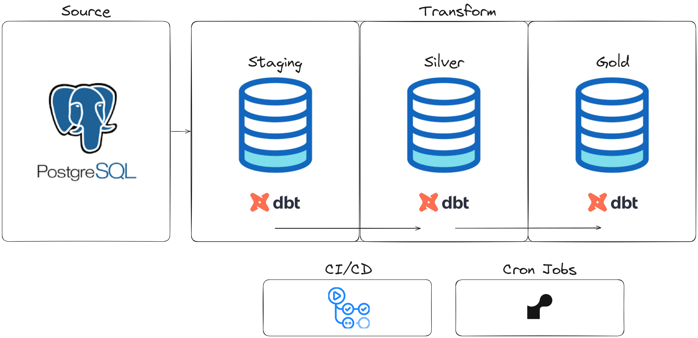

# DBT Northwind

## Overview
This project uses **dbt** (Data Build Tool) to transform and model data from a fictional retail company into an analytical format ready for analysis. dbt allows for creating, testing, and documenting the data transformation pipeline with best practices and code versioning.

The data is stored in a relational POSTGRES database on the AWS RDS service. Additionally, there is a CI/CD routine for pushes, which updates and hosts the project documentation on GitHub Pages.

A Render instance was also used for Cron Jobs to simulate data updates.

Below is the simplified structure of the project:

## Project Structure
Here is the basic structure of the project:

- `models/`: Contains the dbt models, which are SQL transformations organized into subfolders.
  - `staging/`: Staging models (pre-transformation) that load raw data into the Data Warehouse.
  - `silver/`: Intermediate models with additional transformations and cleaning.
  - `gold/`: Final models that provide data ready for analysis.

- `seeds/`: Static data files (CSV) that can be loaded as tables.

- `snapshots/`: Snapshot configurations to capture historical changes in data.

- `macros/`: Contains macros to modularize and reuse SQL.

- `tests/`: Data quality tests.

## Prerequisites
- Python 3.8+
- dbt >= 0.21.0
- Compatible Data Warehouse (e.g., Snowflake, Redshift, Postgres)